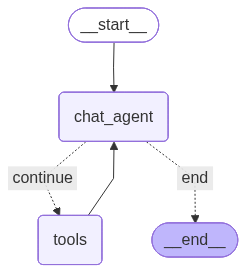
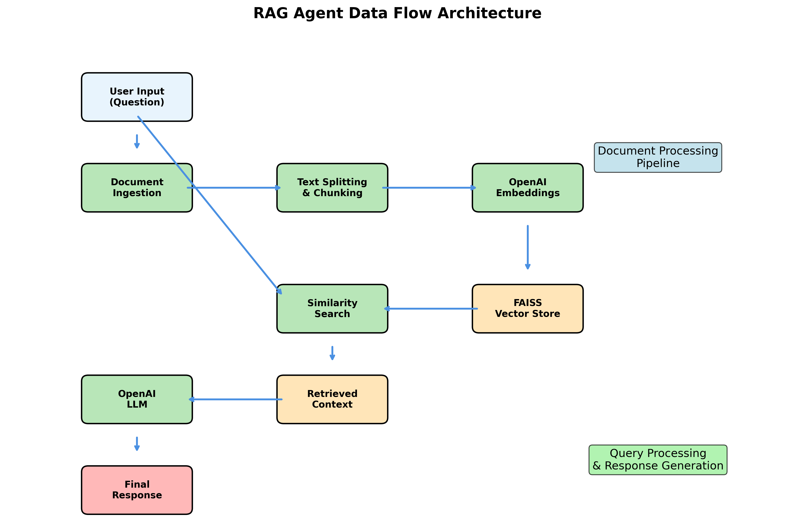

# RAG Document Q&A Agent

A sophisticated document question-answering system built with LangGraph agentic patterns and Streamlit UI. The system supports both user-uploaded documents and internal knowledge bases using RAG (Retrieval-Augmented Generation) technology.

## Features

### 🔄 Dual Document Sources
- **User Upload**: Upload your own PDF or TXT documents
- **Internal Knowledge Base**: Access pre-loaded documents from the `data` folder

### 💬 Advanced Conversation Management  
- Persistent conversation threads with memory
- Multi-turn dialogues with context retention
- Conversation history display
- Thread-based session management

### 🤖 LangGraph Agentic Architecture
- StateGraph-based workflow with memory persistence
- Tool-based retrieval with OpenAI function calling
- Intelligent document chunking and embedding
- FAISS vector store for efficient similarity search

### ⚙️ Centralized Configuration
- Environment variable-based configuration
- Customizable model parameters (temperature, max tokens)
- Configurable chunking and search parameters
- Easy deployment configuration

## Quick Start

### 1. Environment Setup
```bash
# Clone and navigate to project
cd rag-agent

# Configure Python environment
python -m venv rag_agent
source rag_agent/bin/activate  # On Windows: rag_agent\Scripts\activate

# Install dependencies
pip install -r requirements.txt
```

### 2. Configuration
Copy `.env.example` to `.env` and configure:
```env
# OpenAI Configuration
OPENAI_API_KEY=your_openai_api_key_here

# Model Configuration  
OPENAI_MODEL=gpt-4o-mini
OPENAI_TEMPERATURE=0.25
OPENAI_MAX_TOKENS=2048

# Embedding Configuration
EMBEDDING_MODEL=text-embedding-ada-002

# Text Splitting Configuration
CHUNK_SIZE=1024
CHUNK_OVERLAP=256

# Vector Store Configuration
VECTOR_SEARCH_K=2

# Data Folder for Internal Documents
DATA_FOLDER=data
DEBUG_MODE=false #make it true for logs related to state messages
```

### 3. Internal Documents Setup
Add your company documents to the `data` folder:
```
data/
├── company_policies.txt
├── tech_guidelines.txt
├── project_management.txt
└── your_documents.pdf
```

### 4. Run the Application
```bash
# Start Streamlit interface
python -m streamlit run streamlit_app.py --server.port=8002

```

## Usage

### Document Sources

#### Option 1: Upload Your Document
1. Select "Upload your own document" in the sidebar
2. Upload a PDF or TXT file
3. Wait for processing completion
4. Start chatting with your document

#### Option 2: Use Internal Knowledge Base
1. Select "Use internal knowledge base" in the sidebar
2. View available internal documents
3. Click "Load Internal Knowledge Base"
4. Chat with the company knowledge base

### Conversation Features
- **Expandable Text Input**: Text area grows with your input
- **Conversation History**: See all previous questions and answers
- **Thread Persistence**: Maintain context across multiple questions
- **Clear Conversation**: Start fresh while keeping the same document

## Architecture

### System Diagrams

#### LangGraph Workflow
The RAG agent is built using LangGraph's state machine architecture, providing robust conversation flow management:



This diagram shows the actual LangGraph workflow with:
- **chat_agent**: Main conversational AI that processes user messages and decides on tool usage
- **tools**: Retrieval tools for document search (Internal_Knowledge_Search for company documents)
- **Conditional Logic**: Smart routing based on whether tool calls are needed in the response
- **Memory**: Persistent conversation threads with context retention

#### Data Flow Pipeline  
The system processes documents and queries through a comprehensive RAG pipeline:



**Processing Steps:**
1. **Document Ingestion**: PDF/TXT file processing
2. **Text Chunking**: Intelligent splitting with overlap
3. **Embedding Generation**: OpenAI embeddings for semantic understanding
4. **Vector Storage**: FAISS-based similarity search capability
5. **Query Processing**: Real-time retrieval and response generation

### Core Components

#### RAGAgent (`modules/rag_agent.py`)
- **Purpose**: Core RAG functionality with LangGraph architecture
- **Features**: 
  - Document ingestion and processing
  - Vector store creation and management
  - Conversation thread management
  - Tool-based retrieval system

#### Streamlit Interface (`streamlit_app.py`)
- **Purpose**: Primary web interface
- **Features**: 
  - Dual document source selection
  - File upload handling  
  - Chat interface with history
  - Error handling and user feedback

#### Internal Document Management
- **Purpose**: Company knowledge base management
- **Features**: 
  - Automatic document discovery
  - Multi-document indexing
  - Source file tracking
  - Batch processing

### Data Flow
1. **Document Input**: User upload or internal document selection
2. **Processing**: Text extraction, chunking, and embedding generation
3. **Storage**: Vector store creation with FAISS
4. **Retrieval**: Similarity search for user questions
5. **Generation**: LLM response with retrieved context
6. **Memory**: Conversation persistence across interactions

## Configuration Options

### Model Settings
```env
OPENAI_MODEL=gpt-4o-mini          # Model choice
OPENAI_TEMPERATURE=0.25           # Response creativity (0-1)
OPENAI_MAX_TOKENS=2048            # Maximum response length
```

### Document Processing  
```env
CHUNK_SIZE=1024                   # Text chunk size
CHUNK_OVERLAP=256                 # Overlap between chunks
VECTOR_SEARCH_K=2                 # Number of chunks to retrieve
```

### RAGAgent Class Methods

```python
from modules.rag_agent import RAGAgent

# Initialize agent
agent = RAGAgent()

# Upload and process document
agent.ingest_document("path/to/document.pdf")

# Load internal documents
loaded_files = agent.load_internal_documents()

# Chat with documents
response = agent.run("What is the main topic?", thread_id="session-123")

# Get available internal documents
docs = agent.get_available_internal_documents()
```

### Session Management
```python
# Create persistent conversation thread
thread_id = "user-session-123"

# Multiple questions in same thread maintain context
response1 = agent.run("What are the key features?", thread_id)
response2 = agent.run("Can you elaborate on the first one?", thread_id)
```

## Development

## Technical Decisions & RAG Design

### Chunking Strategy
- **Chunk Size**: 1024 tokens - Balances context richness with retrieval precision
- **Overlap**: 256 tokens - Ensures important information isn't lost at chunk boundaries
- **Rationale**: Optimal for document Q&A while staying within LLM context limits

### Model Selection
- **LLM**: `gpt-4o-mini` - Cost-effective while maintaining high quality responses
- **Embeddings**: `text-embedding-ada-002` - Proven performance, 1536 dimensions
- **Temperature**: 0.25 - Low for factual accuracy, slight creativity for natural responses

### Retrieval Approach
- **Vector Store**: FAISS - Fast similarity search without external dependencies
- **Top-K**: 2 chunks - Focused context to avoid information overload
- **Strategy**: Semantic similarity search with LangGraph tool integration

### Prompt Engineering
- **Enhanced System Prompts**: Professional, structured prompts loaded from `config/prompts.py`
- **Response Format**: Structured responses with Answer, Source, and Additional Context sections
- **Source Attribution**: Clear indication of which documents information comes from
- **Transparency**: Explicit acknowledgment when information is not available in documents
- **Query Classification**: Automatic classification of query types (factual, analytical, procedural, summary)
- **Fallback Responses**: Intelligent fallback messages for various scenarios
- **Context Assembly**: Smart context truncation and assembly with confidence indicators

### Architecture Decisions
- **LangGraph**: State machine for robust conversation flow and tool integration
- **Memory**: MemorySaver for conversation persistence across interactions
- **Tools**: Function calling pattern for clean retrieval integration
- **Error Handling**: Comprehensive validation for document processing and user feedback

### What Would Be Added With More Time
- **Enhanced Context Management**: Token counting, smart truncation, relevance scoring
- **Quality Controls**: Response validation, source attribution, confidence scoring
- **Advanced Retrieval**: Re-ranking, similarity thresholds, multi-query strategies
- **Evaluation Framework**: Automated testing, performance benchmarks, quality metrics
- **Production Features**: Rate limiting, caching, monitoring, logging

## Deployment

### Local Development
```bash
python -m streamlit run streamlit_app.py --server.port=8002
```

### Docker Deployment
```bash
# Build image
docker build -t rag-agent .

# Run container
docker run -p 8002:8002 rag-agent

# To check logs 
docker logs <container_name> -f
```

### Adding New Features
1. Update configuration in `.env`
2. Add new modules in `modules/` directory
3. Update RAGAgent class methods
4. Add corresponding UI elements
5. Create tests for new functionality

## License

This project is licensed under the MIT License.

Built using :  LangGraph, OpenAI, Streamlit, and FAISS
